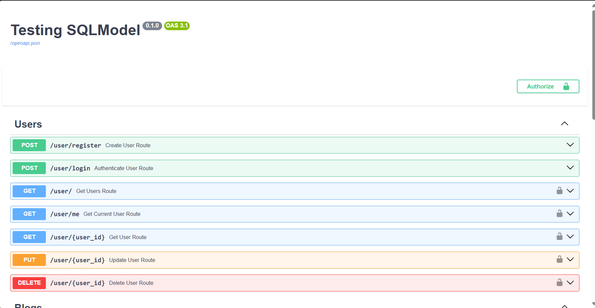
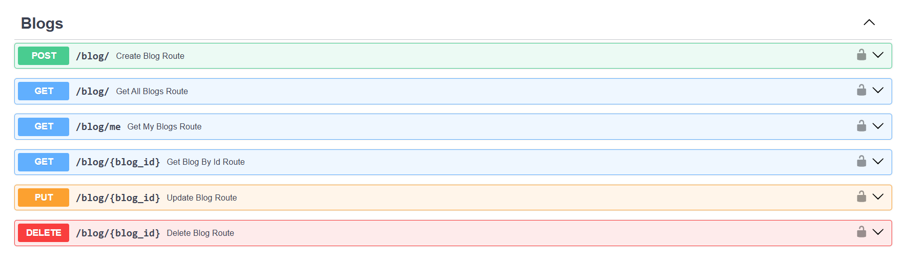
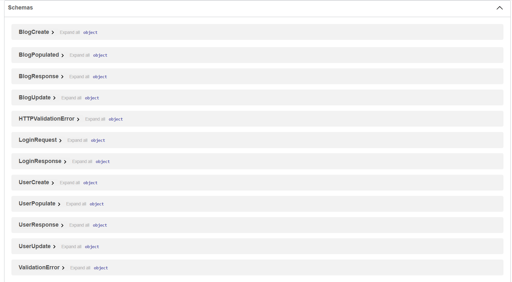

# Testing FastAPI with simple Blog Application

## Context and reviews

- Simple User-Blog role based application using ``FastAPI`` and ``MongoDB``. 
> I created the same application with `PostgreSQL` reling on `SQLAlchemy` but I like this one better
- The idea of pydantic and data schemas is a **DTO** (Data Transfer Object) exemple but the way it works in ``Nestjs`` or `ExpressTS` (``express.js`` but running within ``Typescript`` environment) is way better and smoother than it is in ``Python``.

## Libraries

- Pymongo and Motor for mongodb communication and DB quering
- PyJWT for JWT management
- Passlib for hashing and verifying
- Pydantic for data validations and schemas
- uvicorn to run server

## EndPoints





## Schemas



## Docker compose fils

1. [Development Compose](./docker-compose-dev.yml) is used to create a mongo and mongo express instance for development
    ```bash
    docker compose -f docker-compose-dev.yml up -d
    ```

2. [Test Compose](./docker-compose-test.yml) is used after the developement and after the creating of docker image to test the behavior of container
     ```bash
    docker compose -f docker-compose-test.yml up -d
    ```

## To do 

- [ ] Delete User triggers delete all his blogs first
- [ ] Activate/Deactivate account
- [ ] Redis and notification